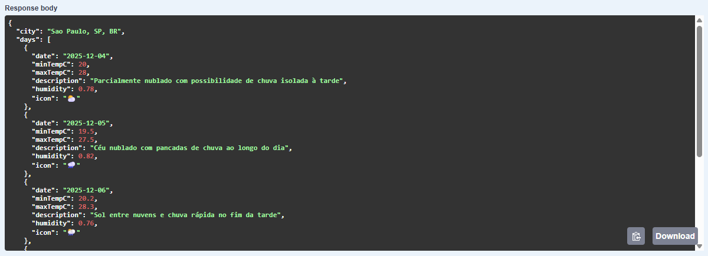
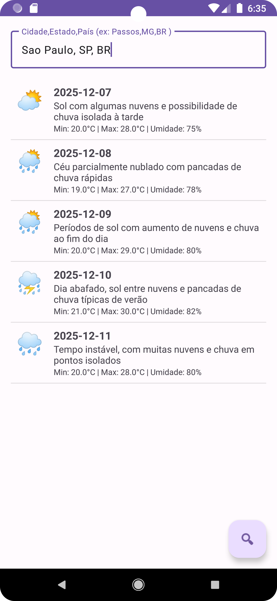
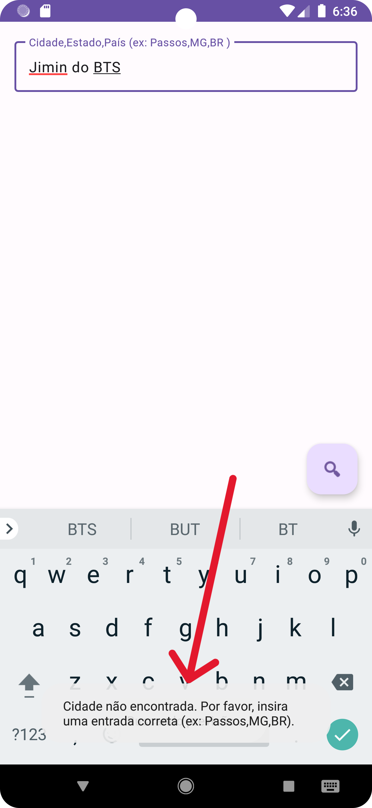

# WeatherViewer App - Atividade Prática Individual: Consumo de Web Service de Previsão do Tempo

## 1. Informações do Projeto

| | |
| :--- | :--- |
| **Nome da Aluna** | Beatriz da Costa Lauro |
| **Curso** | Sistemas de Informação |
| **Período e Disciplina** | 6° - Programação III |

## 2. Contexto e Descrição da Aplicação

Este projeto é o resultado da **Atividade Prática Individual** da disciplina de Programação III, que consiste no desenvolvimento de uma aplicação cliente de previsão do tempo para Android. O desenvolvimento toma como referência direta o **Capítulo 7 – WeatherViewer App** do livro utilizado na disciplina, aplicando seus conceitos de consumo de Web Service REST.

O **WeatherViewer App** é um aplicativo Android desenvolvido em Java que consome uma API de previsão do tempo customizada, disponibilizada pelo professor e hospedada na AWS. O aplicativo realiza requisições HTTP em uma thread separada (`AsyncTask`), processa a resposta em formato JSON e exibe os dados em uma lista personalizada (`ListView`).

### Funcionalidades Implementadas

*   **Referência Bibliográfica:** Baseado na arquitetura e padrões de consumo de API do Capítulo 7 do livro "Android 6 for Programmers".
*   **Entrada de Dados:** Campo de texto para o nome da cidade no formato **Cidade,Estado,País** (ex: `Passos,MG,BR`).
*   **Requisição Assíncrona:** Utilização de `AsyncTask` e `HttpURLConnection` para realizar a consulta à API.
*   **Processamento de JSON:** Análise e extração dos dados de previsão (data, temperatura min/max, umidade, descrição e ícone) utilizando a biblioteca `org.json`.
*   **Exibição:** Apresentação dos dados em uma lista otimizada com o padrão `ViewHolder`.
*   **Tratamento de Erros (Requisito Adicional):** Implementação de validação para entradas incorretas de cidade. Caso a API retorne um erro **HTTP 404 (Not Found)**, o aplicativo exibe uma mensagem clara ao usuário: **"Cidade não encontrada. Por favor, insira uma entrada correta (ex: Passos,MG,BR)."**

## 3. Instruções para Execução

1.  **Clone o Repositório:**
    ```bash
    git clone https://github.com/beatrizlauro/weatherViewer.git
    ```
2.  **Abra no Android Studio:**
    *   Abra o Android Studio e selecione `File > Open`.
    *   Navegue até a pasta do projeto clonado e selecione a subpasta `WeatherViewer`.
3.  **Sincronize o Gradle:**
    *   Aguarde o Android Studio sincronizar o projeto e baixar as dependências necessárias.
4.  **Execute:**
    *   Selecione um emulador ou dispositivo físico.
    *   Clique no botão **Run** (Play verde) na barra de ferramentas.
5.  **Teste:**
    *   No campo de texto, digite a cidade no formato **Cidade,Estado,País** (Ex: `Passos,MG,BR`).
    *   Clique no botão flutuante (lupa) para buscar a previsão.
    *   **Teste a Validação:** Insira uma cidade inexistente (Ex: `CidadeInvalida,XX,YY`) para verificar a mensagem de erro.

## 4. Exemplo da URL Utilizada na Requisição

A API utilizada é a fornecida pelo professor, mantendo a mesma proposta do Capítulo 7. A URL é construída dinamicamente no código (`MainActivity.java`) com os parâmetros obrigatórios: `city`, `days` (fixado em 5) e `APPID`.

**Endpoint Base:**
`http://agent-weathermap-env-env.eba-6pzgqekp.us-east-2.elasticbeanstalk.com/api/weather`

**Chave de API (APPID):**
`AgentWeather2024_a8f3b9c1d7e2f5g6h4i9j0k1l2m3n4o5p6`

**Exemplo de URL Completa (para a cidade de Passos, MG, Brasil):**

```
http://agent-weathermap-env-env.eba-6pzgqekp.us-east-2.elasticbeanstalk.com/api/weather?city=Passos,MG,BR&days=5&APPID=AgentWeather2024_a8f3b9c1d7e2f5g6h4i9j0k1l2m3n4o5p6
```




## 5. Observações e Requisitos Atendidos

O projeto atende a todos os requisitos da Atividade Prática Individual, incluindo o tratamento de erros de requisição para cidades não encontradas.

*   **Tratamento de Erros:** Implementado para erros de rede, JSON inválido e, especificamente, para o erro **404 (Cidade Não Encontrada)**.
*   **Estrutura de Código:** Segue as boas práticas de separação de responsabilidades (Activity, Adapter, Modelo de Dados) e utiliza `AsyncTask` para operações de rede.

<p align="center">
  
  
</p>